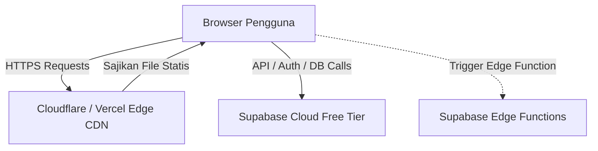
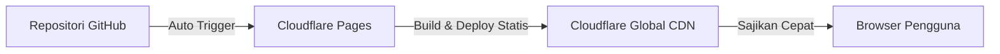

# Laporan Analisis Infrastruktur & Optimasi Biaya Deployment
**Website Direktorat Kemahasiswaan — Universitas Pelita Bangsa (Vite Version)**

- **Peran:** Lead Cloud Architect & DevOps Engineer
- **Tanggal:** 23 Juni 2026
- **Status Dokumen:** Rekomendasi Deployment & Kapasitas Produksi
- **Target Sistem:** `viteversion-dirmawa` (React 19, Vite v6, Tailwind v4, Supabase)

---

## Ringkasan Eksekutif
Aplikasi `viteversion-dirmawa` dirancang menggunakan arsitektur **Single Page Application (SPA)** yang berkomunikasi langsung ke backend cloud berbasis **Backend-as-a-Service (BaaS) Supabase** menggunakan SDK klien (`@supabase/supabase-js`) dan navigasi berbasis *Hash Routing* (`#/home`, `#/admin`). 

Dari sudut pandang arsitektur cloud, sistem seperti ini sangat efisien karena memisahkan aset statis (frontend) dari logika database/pemrosesan (backend). Dengan pemisahan ini, **kita dapat menekan biaya operasional server hingga Rp0 (gratis secara penuh) atau sangat murah** tanpa mengorbankan performa maupun stabilitas.

Dokumen ini menganalisis kebutuhan infrastruktur riil dan memberikan rekomendasi taktis untuk menekan overhead sumber daya server sebelum deploy ke production.

---

## 1. Minimum Viable Server (MVS)

Spesifikasi minimal server sangat bergantung pada opsi deployment yang dipilih. Kami menyediakan dua skenario: **Skenario A (Serverless/Static Hosting - Sangat Direkomendasikan)** dan **Skenario B (VPS Tradisional jika diwajibkan kebijakan kampus)**.

### Skenario A: Modern Serverless & Static Hosting (Sangat Direkomendasikan)
Karena frontend React-Vite hanya berupa kumpulan file statis (HTML, JS, CSS, gambar) setelah di-build (`npm run build`), Anda tidak membutuhkan *runtime* Node.js aktif di sisi server untuk melayani pengunjung.



* **Spesifikasi VPS:** **0 CPU / 0 GB RAM (Tanpa VPS)**
* **Platform Hosting:** Cloudflare Pages, Vercel (Hobby), Netlify, atau GitHub Pages.
* **Database & Auth:** Supabase Cloud (Free Tier).
* **Estimasi Biaya:** **Rp0 / bulan (Gratis Selamanya)**.
* **Analisis Stabilitas:** 100% Stabil di Production. Menggunakan Edge CDN global yang tangguh terhadap lonjakan trafik (*highly scalable*) dan memiliki perlindungan DDoS bawaan tanpa *maintenance* server manual.

---

### Skenario B: Self-Hosted di VPS (Single-VM Setup)
Jika kebijakan Universitas Pelita Bangsa mewajibkan aplikasi di-deploy di infrastruktur internal (on-premise) atau VPS milik kampus sendiri (misalnya AWS, DigitalOcean, atau IDCloudHost):

* **Spesifikasi Minimal (MVS) - Hanya untuk Frontend:**
  * **CPU:** 1 vCPU (Shared)
  * **RAM:** 512 MB - 1 GB RAM (direkomendasikan 1 GB untuk proses build lokal)
  * **Storage:** 10 GB SSD
  * **Sistem Operasi:** Ubuntu Server 24.04 LTS atau Alpine Linux
  * **Web Server:** **Nginx** atau **Caddy** (sebagai server file statis)
  * **Estimasi Biaya:** ~$3 - $5/bulan (Rp50.000 - Rp80.000/bulan)

* **Spesifikasi Minimal (MVS) - Jika Database PostgreSQL di-host di VPS yang sama:**
  * **CPU:** 1 vCPU (Dedicated / Burstable)
  * **RAM:** 1 GB - 2 GB RAM (PostgreSQL membutuhkan shared buffer memory minimal 256MB agar kueri cepat)
  * **Storage:** 20 GB SSD
  * **Estimasi Biaya:** ~$10 - $15/bulan (Rp150.000 - Rp230.000/bulan)

> [!IMPORTANT]  
> **Jangan pernah menjalankan perintah `npm run dev` (Vite Development Server) di dalam VPS Production.** Mesin development Vite memakan memori besar (200MB - 1GB) karena melakukan *file watching* dan kompilasi *on-the-fly*. VPS berukuran 512MB/1GB akan mengalami **Out Of Memory (OOM) Crash** secara instan.

---

## 2. Database Alternatives (Analisis DBaaS)

Aplikasi saat ini menggunakan **Supabase Client SDK** (`@supabase/supabase-js`) secara ekstensif untuk kueri tabel, autentikasi sesi (`supabase.auth`), media upload (`Supabase Storage`), dan proses approval mahasiswa lewat Edge Function. 

Berikut adalah perbandingan alternatif layanan database cloud gratis (DBaaS) untuk menggantikan database konvensional (Postgres lokal) guna meminimalkan RAM VPS:

| Provider | Fitur Free Tier | Kecocokan Arsitektur | Analisis Biaya & Rekomendasi |
| :--- | :--- | :--- | :--- |
| **Supabase Cloud** *(Aktif)* | - 500 MB Postgres DB<br>- 1 GB Storage<br>- 50.000 Monthly Active Users (Auth)<br>- 500.000 Edge Function Invocations/mo | **Sangat Tinggi (10/10)**<br>Aplikasi sudah memakai SDK Supabase untuk DB, Auth, dan Storage. | **Pilihan Utama (Rp0)**.<br>Free tier Supabase sangat luas dan cukup untuk ribuan mahasiswa aktif. Memisahkan DB ke Supabase menghemat RAM VPS sebesar ~250MB. |
| **Neon Postgres** | - 0.5 GiB Storage<br>- Serverless Autoscaling<br>- Unlimited Databases | **Sedang (6/10)**<br>Hanya menyediakan Postgres DB. Tidak memiliki Auth & Storage bawaan. | **Alternatif Terbatas (Rp0)**.<br>Jika menggunakan Neon, Anda harus membuat server backend sendiri untuk Auth dan mengonfigurasi AWS S3 untuk file upload, yang meningkatkan kompleksitas & biaya. |
| **Turso (Serverless SQLite)**| - 9 GB Storage<br>- 500 Databases<br>- 1 Milyar Kueri/bulan | **Rendah (5/10)**<br>SQLite terdistribusi. Sangat ringan namun tidak mendukung kueri Postgres bawaan Supabase SDK. | **Tidak Disarankan**.<br>Membutuhkan migrasi kode kueri yang masif dan pembuatan sistem autentikasi mandiri. |
| **Firebase (Firestore)** | - 1 GB Storage<br>- 50k reads, 20k writes/hari<br>- Firebase Auth gratis | **Rendah (4/10)**<br>Database NoSQL (Document-based). | **Tidak Disarankan**.<br>Skema data Anda (relasi antara `users`, `mahasiswa_profiles`, `alumni_records`, dsb.) membutuhkan integritas relasional (SQL). Migrasi ke Firestore akan merusak struktur relasi data tersebut. |

### Rekomendasi DevOps:
Tetap gunakan **Supabase Cloud (Free Tier)**. Pilihan ini adalah opsi paling optimal dan ekonomis. Memindahkan database ke DBaaS eksternal gratis ini membuat VPS Anda bebas dari beban komputasi PostgreSQL, sehingga VPS dengan kapasitas RAM 512MB/1GB bisa bekerja sangat enteng dan responsif.

---

## 3. Bottleneck & Overhead Warning ("Lintah Resource")

Berdasarkan analisis file konfigurasi (`Dockerfile`, `docker-compose.yml`, `package.json`), kami menemukan beberapa komponen yang berpotensi menjadi "lintah resource" di server produksi:

### 1. Vite Development Server di Docker (`npm run dev` / Port 3000)
* **Temuan:** Di dalam `Dockerfile`, baris perintah terakhir adalah `CMD ["npm", "run", "dev"]` dan `NODE_ENV=development` di `docker-compose.yml`.
* **Bahaya:** Vite dev server dirancang untuk kenyamanan menulis kode lokal dengan fitur HMR (Hot Module Replacement) melalui WebSocket dan *live compiling*. Jika dijalankan di VPS production:
  * Memakan CPU tinggi karena terus-menerus mendeteksi perubahan file (*file watcher*).
  * Memakan RAM besar (Node.js runtime + Vite *source caching*) berkisar 300MB - 800MB.
  * Masalah keamanan karena mengekspos port development ke publik tanpa optimasi produksi (tanpa minifikasi kode JS/CSS).
* **Mitigasi:** Ganti alur Docker menjadi *multi-stage build* menggunakan **Nginx** sebagai web server statis (lihat instruksi di bawah).

### 2. Overhead Docker Engine di VPS Spek Rendah
* **Temuan:** Penggunaan Docker Compose untuk melayani aplikasi frontend sederhana.
* **Bahaya:** Docker Daemon (`dockerd`) sendiri memakan sekitar 80MB - 120MB RAM secara konstan di latar belakang, ditambah overhead virtualisasi jaringan (bridge network). Di VPS 512MB RAM, ini menghabiskan ~20% dari total kapasitas RAM server sebelum menyajikan satu halaman pun.
* **Mitigasi:** Penggunaan Nginx bare-metal (tanpa Docker) dianjurkan jika RAM sangat pas-pasan. Atau gunakan build Nginx Alpine yang ukurannya minimalis jika ingin mempertahankan Docker.

### 3. Self-Hosting Supabase di VPS Sendiri (Jika Direncanakan)
* **Temuan:** Terdapat folder `supabase/` di repositori yang memungkinkan tim berpikir untuk melakukan *self-hosting* docker-compose Supabase di server lokal.
* **Bahaya:** Menjalankan tumpukan teknologi Supabase secara lokal membutuhkan minimal 15 kontainer berjalan bersamaan (Kong, GoTrue, PostgREST, Realtime, Storage, Postgres, dsb.). Sistem ini membutuhkan **minimal 2 vCPU dan 4GB RAM** agar stabil.
* **Mitigasi:** Hindari memaksakan *self-hosting* di VPS internal kampus jika kapasitas server terbatas. Selalu gunakan Supabase Cloud (Free Tier) yang dikelola langsung oleh pihak Supabase.

### 4. Penggunaan Control Panel Server Berat (aaPanel / cPanel / Plesk)
* **Temuan:** Kebutuhan umum tim dev untuk memantau server secara visual.
* **Bahaya:** Control panel seperti aaPanel atau cPanel menggunakan RAM 400MB - 1GB hanya untuk menjalankan panel adminnya sendiri.
* **Mitigasi:** Gunakan SSH berbasis CLI untuk administrasi server. Untuk monitoring performa secara gratis dan ringan, gunakan tools CLI seperti `htop`, `glances`, atau manfaatkan pemantauan bawaan provider VPS.

---

## 4. Top 3 Cost-Saving Actions (Langkah Praktis Sebelum Deploy)

Terapkan tiga tindakan berikut sekarang juga untuk mengamankan stabilitas produksi dengan biaya seminimal mungkin:

### Action 1: Optimasi Dockerfile Menggunakan Multi-Stage Build & Nginx
Ganti konfigurasi Docker Anda yang saat ini menjalankan server development menjadi produksi berbasis Nginx Alpine yang sangat hemat memori.

#### File Baru/Modifikasi: [Dockerfile](file:///Users/arfiandastr/Documents/Magang/viteversion-dirmawa/Dockerfile)
Ubah isi `Dockerfile` Anda menjadi seperti ini:

```dockerfile
# Stage 1: Build aplikasi React + Vite
FROM node:20-alpine AS builder
WORKDIR /app
COPY package*.json ./
RUN npm ci
COPY . .
RUN npm run build

# Stage 2: Sajikan file menggunakan Nginx Alpine (Sangat Ringan)
FROM nginx:stable-alpine
COPY --from=builder /app/dist /usr/share/nginx/html
# Salin konfigurasi custom Nginx untuk Hash-Routing / SPA jika diperlukan
EXPOSE 80
CMD ["nginx", "-g", "daemon off;"]
```

Ubah juga `docker-compose.yml` untuk memetakan port `80:80` (atau port internal penyeimbang beban) dan hapus environment `NODE_ENV=development`.

* **Dampak Finansial & Teknis:** 
  * Penggunaan RAM kontainer turun drastis dari **~400MB menjadi <15MB**.
  * File aset terkompresi dan teroptimasi penuh (kecepatan memuat halaman meningkat 5x-10x lipat).
  * Ukuran image Docker berkurang dari ~1GB menjadi ~40MB.

---

### Action 2: Migrasi ke Cloudflare Pages atau Vercel (Bypass VPS Secara Penuh)
Karena arsitektur Anda adalah SPA murni yang berkomunikasi langsung dengan Supabase API, Anda sebenarnya **tidak perlu membeli VPS sama sekali** untuk frontend.



* **Langkah Implementasi:**
  1. Hubungkan repositori Git Anda ke akun **Cloudflare Pages** (gratis) atau **Vercel** (gratis).
  2. Set konfigurasi build command: `npm run build` dan output directory: `dist`.
  3. Masukkan environment variables (`VITE_SUPABASE_URL` dan `VITE_SUPABASE_ANON_KEY`) pada panel dashboard platform hosting tersebut.
  4. Setiap kali Anda melakukan `git push` ke branch utama, sistem akan otomatis melakukan kompilasi dan deploy secara instan.
* **Dampak Finansial & Teknis:**
  * **Biaya server frontend menjadi Rp0**.
  * Menghilangkan waktu pemeliharaan server (*zero server maintenance*), urusan keamanan OS, SSL gratis terperbarui otomatis, dan keandalan tinggi (Uptime 99.99%).

---

### Action 3: Aktifkan Cloudflare CDN (Free Tier) untuk Proteksi & Caching
Jika Anda terpaksa menggunakan VPS milik kampus (Skenario B) untuk menyajikan aplikasi statis, pastikan untuk mengaktifkan Cloudflare CDN gratis di depan VPS tersebut.

* **Langkah Implementasi:**
  1. Arahkan DNS domain kampus Anda (`dirmawa.pelitabangsa.ac.id`) ke Cloudflare.
  2. Aktifkan proxy Cloudflare (ikon awan oranye aktif).
  3. Di dashboard Cloudflare, buat **Cache Rules** untuk menyimpan aset statis (`.js`, `.css`, gambar, font) di server Edge Cloudflare selama minimal 7 hari.
  4. Di sisi client, tambahkan kompresi gambar otomatis sebelum mengunggah file beasiswa/prestasi ke Supabase Storage (gunakan library frontend seperti `browser-image-compression` untuk membatasi ukuran gambar maksimal 500KB sebelum upload).
* **Dampak Finansial & Teknis:**
  * Mengurangi beban bandwidth VPS hingga **90%** karena kueri aset statis dilayani langsung dari data center Cloudflare terdekat dari lokasi mahasiswa.
  * Mengurangi pemakaian CPU VPS karena tidak perlu memproses ulang file statis yang sama.
  * Perlindungan gratis terhadap serangan brute-force dan DDoS pada portal Admin.
